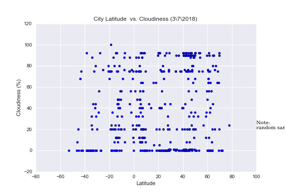

Unit 12 | Assignment - Web Visualization Dashboard (Lattitude)
-------------------------------------------------------------------


Background

created a Web visualization dashboard website using HTML, BootStrap, and CSS to showcase the data from the WeatherAPI homework Analysis project.


```python
from IPython.display import Image
```

Summary: Latitude vs. X                                                
--------------------------    


```python
Image(filename='tempvslat.png') 
```


```python
Image(filename='latvswin.png') 

```


```python
Image(filename='latvshum.png') 
```


```python
Image(filename='latvsclou.png') 
```





